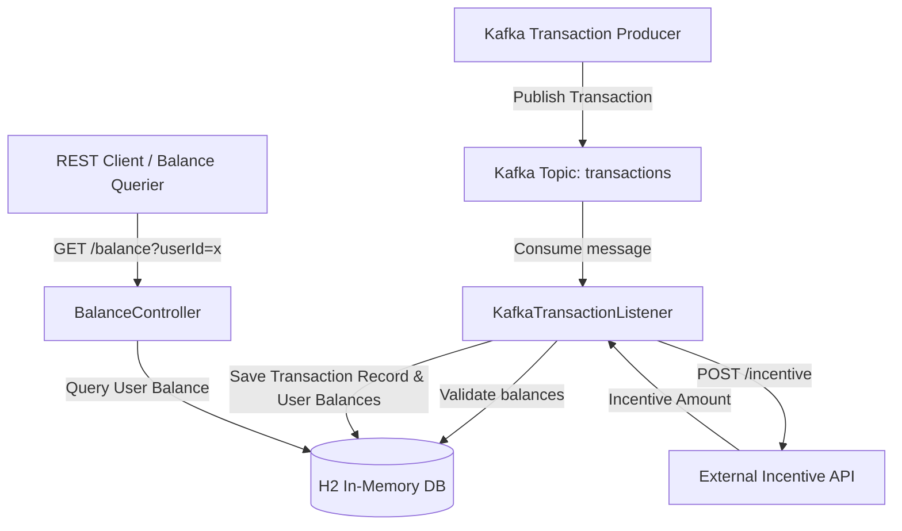

# 🪙 Midas Core

Midas Core is a high-performance backend transaction processing engine designed as part of the **JPMorgan Chase Software Engineering Program**. It implements a distributed ledger workflow using **Spring Boot**, **Apache Kafka**, and **H2 JPA-based Database Persistence**. 

The engine processes transaction messages via a Kafka topic, validates sender balances, integrates with a external Incentive REST API, persists transaction records to a database, and exposes balance query endpoints.

---

## 🏗️ System Architecture

Midas Core works by combining a message-driven pipeline with a relational database and a REST API surface. Here is how the key components communicate:



---

## ⚙️ Core Technical Stack

- **Framework**: Spring Boot 3.2.x (Web & Data JPA starters)
- **Message Broker**: Apache Kafka (utilizing embedded Kafka for integration testing)
- **Database**: H2 In-Memory Relational Database
- **Communication**: Spring RestTemplate (HTTP/REST)

---

## 🛠️ Implemented Tasks & Features

### 🔹 Task 1 to 3: Core Transaction Pipeline
* Configured Kafka Consumer & Producer properties using custom serializer/deserializer settings.
* Implemented `KafkaTransactionListener` to consume transaction messages from the Kafka topic.
* Built the JPA Database entities `UserRecord` and `TransactionRecord` to persist customer states.
* Implemented double-entry transaction validation:
  $$\text{Sender Balance} \ge \text{Transaction Amount}$$
  Upon validation, balances are adjusted and the transaction is committed to H2.

### 🔹 Task 4: Incentive REST API Integration
* Integrated an external REST API running at `http://localhost:8080/incentive`.
* Used Spring `RestTemplate` to forward validated transactions to the Incentive service.
* Deserialized response payloads into `Incentive` objects.
* Updated balance processing rules:
  * **Sender balance** = sender balance - transaction amount.
  * **Recipient balance** = recipient balance + transaction amount + incentive amount.
  * *Note: The incentive amount is NOT deducted from the sender.*

### 🔹 Task 5: REST API Balance Queries
* Configured the application server to run on port `33400` inside `application.yml`.
* Developed a new `@RestController` (`BalanceController`) exposing GET `/balance?userId=...`.
* Looks up user details from H2 and returns user balances serialized to JSON. Returns `Balance(0.0)` if the user ID is invalid or not found.

---

## 🚀 Setup & Execution Instructions

### Prerequisites
* Java Development Kit (JDK) 17 or higher
* Maven (or use the provided Maven Wrapper `mvnw`)

### 1. Running the External Incentive Service
Before starting the application or running integration tests, start the pre-packaged Incentive API jar:
```powershell
# From the project root directory
java -jar services/transaction-incentive-api.jar
```
This runs the Incentive API on port `8080` (accessible at `http://localhost:8080/incentive`).

### 2. Building & Running Tests
To verify all tasks (including Task 4 and Task 5 verifiers) pass:
```powershell
# Run all unit and integration tests
.\mvnw.cmd clean test
```

### 3. Running Midas Core Locally
To launch the Spring Boot application server locally:
```powershell
.\mvnw.cmd spring-boot:run
```
The REST controller will be listening for balance queries at:
`http://localhost:33400/balance?userId={id}`

---

## 📝 API Endpoints

### 💳 Exponent query (Midas Core)
* **URL**: `GET http://localhost:33400/balance`
* **Query Parameter**: `userId` (Long)
* **Response Format**: JSON
* **Sample Response**:
  ```json
  {
    "amount": 3089.42
  }
  ```

---

## 📂 Project Structure

```text
forage-midas/
├── services/
│   └── transaction-incentive-api.jar  # External Incentive REST API
├── src/
│   ├── main/java/com/jpmc/midascore/
│   │   ├── component/
│   │   │   └── DatabaseConduit.java   # JPA persistence wrapper
│   │   ├── controller/
│   │   │   └── BalanceController.java # Task 5: REST API Endpoint
│   │   ├── entity/
│   │   │   ├── TransactionRecord.java # JPA Transaction Entity
│   │   │   └── UserRecord.java        # JPA User Entity
│   │   ├── foundation/
│   │   │   ├── Balance.java           # Balance representation POJO
│   │   │   ├── Incentive.java         # Task 4: Incentive API response
│   │   │   └── Transaction.java       # Transaction representation POJO
│   │   ├── repository/
│   │   │   ├── TransactionRecordRepository.java
│   │   │   └── UserRepository.java
│   │   ├── KafkaConfig.java           # Kafka Serializer/Deserializer config
│   │   ├── KafkaTransactionListener.java # Kafka message listener
│   │   └── MidasCoreApplication.java  # Spring Boot Main Class
│   └── test/java/com/jpmc/midascore/
│       ├── TaskFourTests.java         # Task 4 Integration Test Suite
│       └── TaskFiveTests.java         # Task 5 REST Verification Suite
├── application.yml                    # Spring Boot Config (Ports & Kafka Settings)
└── pom.xml                            # Maven Dependency Descriptor
```
